# Ethara Project OS — End-to-End Workflow

From a login arriving with no identity, through role derivation and two independent
authorization layers, to a project being created, staffed, worked and archived.

Three modules cooperate:

| Module | Owns |
|---|---|
| `api_auth_gateway` | tokens, `api.role`, the endpoint-grant gate for the platform API |
| `pod_roles` | the four organisational roles as `api.role` records, and the app menu tree |
| `ethara_project_os` | the four Odoo groups, the project lifecycle, and its own 52-route API |

**Vocabulary.** Four levels, weakest to strongest — `tasker → pl → pm → admin`. `PM` is
**Programme Manager**, the level *above* Pod Lead. Before `19.0.1.5.0` this module called
that level `gpm` and used `pm` for the bottom level; anything still using the old words is
reading the ladder upside down. The names now match `pod_roles` exactly, which is the point.

---

## Part 1 — Where a role comes from

Project OS owns **no role table**. It owns four Odoo groups (because ACLs and record rules
can only be written against groups) and derives membership from `res.users.user_role`,
which points at an `api.role` record.

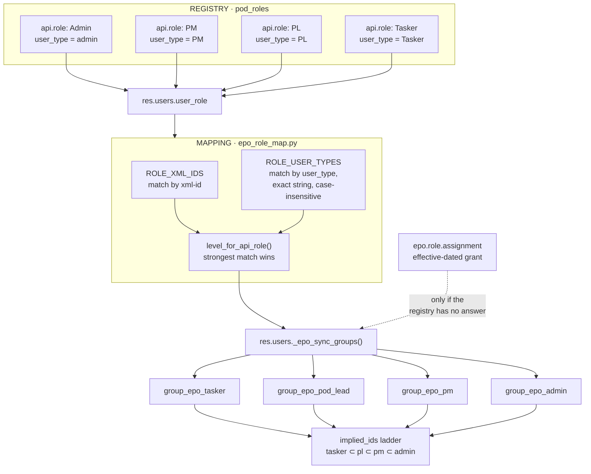

### The mapping, as shipped

| `pod_roles` record | `user_type` | Project OS level | Odoo group |
|---|---|---|---|
| `role_admin` | `admin` | `admin` | `group_epo_admin` |
| `role_pm` | `PM` | `pm` | `group_epo_pm` |
| `role_pl` | `PL` | `pl` | `group_epo_pod_lead` |
| `role_tasker` | `Tasker` | `tasker` | `group_epo_tasker` |

Two routes into the map, because a role can arrive either way:

1. **xml-id** — shipped in a data file, explicit and versionable.
2. **`user_type`** — a record somebody created in Settings, which has no xml-id at all.
   Without this route, UI-created roles would never map.

`user_type` matching is **exact string, case-insensitive — never substring**. This is
load-bearing: `TPM` contains `PM`, and a substring rule would silently map every TPM onto
the programme-management level. `role_tpm_technical` is deliberately unmapped — TPM is a
different job, and guessing would hand out project creation and allocation rights.

### Two safety properties

- **A missing role resolves to nothing, it does not raise.** `resolve_role_ids` skips
  records it cannot find, so a half-populated registry degrades instead of crashing.
- **`epo.role.assignment` is the fallback.** While `user_role` yields no level, groups come
  from the effective-dated grant. The moment a mapped `api.role` is set, that wins.

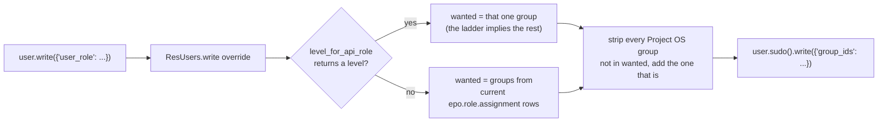

> **Note the direction of failure.** Because any registry answer is authoritative, giving a
> PM-by-grant a `user_role` of PL *demotes* them and ignores the grant. Fail-safe (access is
> lost, never gained) but silent.

---

## Part 2 — Authentication and authorization

There are **two independent systems**. Conflating them is the single easiest mistake to
make here.

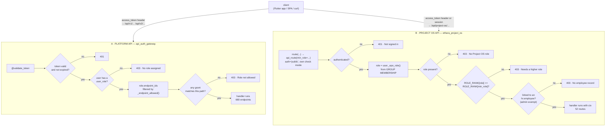

### A · Platform API — grant-based

`validate_token` resolves the token to a user, reads `user_role`, and checks the request
path against that role's `api.role.endpoint` grants. This gates all **680** registered
endpoints — taskforge (112), etp_projects (77), ethara_project (61), etp_assessment_ext
(46), hrms, wiki and ~130 more prefixes.

The convention for granting is narrow and per-module: the module that owns an endpoint
declares who may call it, one `(role, endpoint, method)` triple at a time.

```xml
<record id="role_ep_candidate_me_get" model="api.role.endpoint">
    <field name="role_id" ref="api_auth_gateway.role_candidate_technical"/>
    <field name="api_end_point_id" ref="endpoint_api_v1_candidates_me"/>
    <field name="method">GET</field>
</record>
```

### B · Project OS API — rank-based

Project OS registers 52 routes under `/api/project-os/` with `auth='public'` and does its
own check inside, so one route serves both a token client and a session client. **None of
its endpoints are in `api.endpoint`**, so the grant system does not apply to it at all.

Authorization is a rank floor per route:

```python
ROLE_RANK = {'tasker': 0, 'pl': 1, 'pm': 2, 'admin': 3}
if ROLE_RANK[role] < ROLE_RANK[min_role]:
    return respond(status=403)
```

| `min_role` | routes | what they are |
|---|---:|---|
| `tasker` | 2 | own onboarding, own form |
| `pl` | 7 | pod roster, pod submissions |
| `pm` | 21 | create/activate projects, knowledge, templates, allocation, analytics |
| `admin` | 2 | void a submission, unlock a payroll-locked roster day |

`_epo_role()` reads **group membership**, not the employee record — so a service account
with the admin group and no employee row still works. Membership itself comes from Part 1,
so the two always agree.

Record rules then narrow *which rows* each level sees, independently of route access:

| Level | Scope |
|---|---|
| `tasker` | themselves |
| `pl` | themselves + their pod + direct reports |
| `pm` | org-wide |
| `admin` | org-wide, plus audit and correction paths |

---

## Part 3 — Project setup

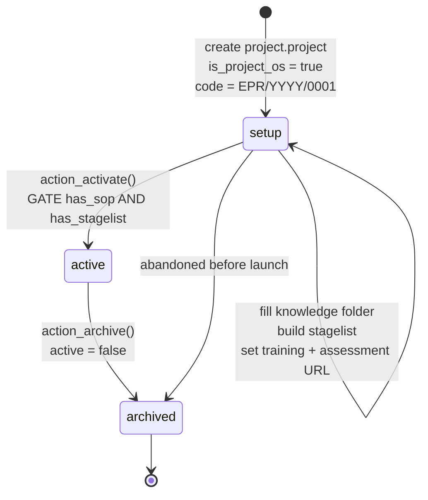

A project is an **extension of Odoo's native `project.project`** (`_inherit`), not a
separate model. `ethara_state` is deliberately namespaced so the native `stage_id` stays
free for kanban columns.

### The go-live gate

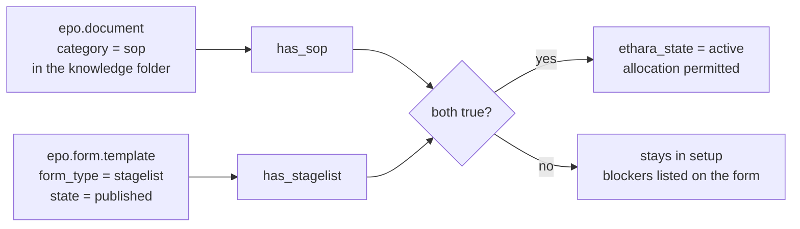

Enforced at the database level, not just in Python:

```sql
CHECK (ethara_state <> 'active'
       OR (COALESCE(has_sop, false) AND COALESCE(has_stagelist, false)))
```

`COALESCE` is not decoration — both columns are nullable and **a CHECK passes on NULL**, so
without it a project could be stored `active` with no SOP and no stagelist. Closed in
`19.0.1.3.1`.

### The filing cabinet

Every project gets the same skeleton on creation, so nobody faces an empty screen:

```
Knowledge/                     ← visible to anyone allocated to the project
├── SOP/                       ← mandatory; drives has_sop
├── Common Errors/
├── Task Videos/
└── Other/
Management/                    ← PM and Admin only
└── Client Documents/
```

Documents are stored in S3 via `s3.connector` (`s3_key` + presigned URLs, never public) or
as a link. `read_bytes()` degrades cleanly when no bucket is configured.

### Forms are versioned, not edited

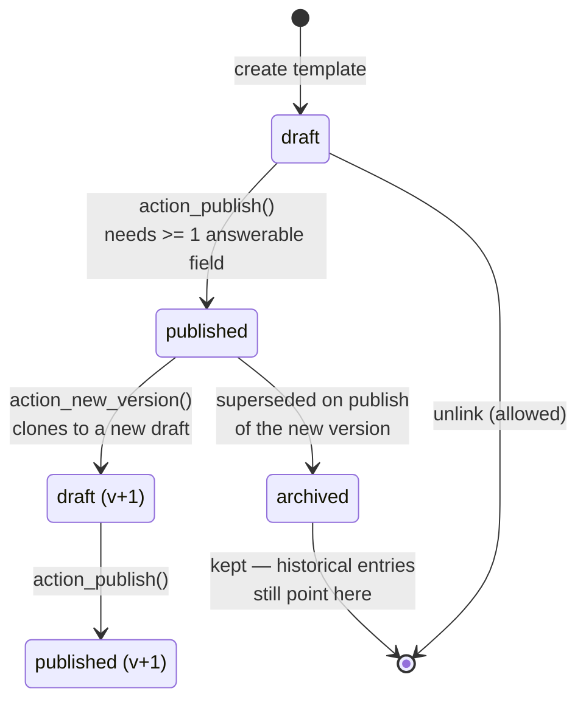

A published template is immutable — its fields and sections refuse create, write and
unlink. Publishing a new version archives the old one; historical `epo.form.entry` rows keep
pointing at the archived version so their answers stay readable. One published template per
`(project, form_type)`, enforced by a partial unique index.

---

## Part 4 — Onboarding

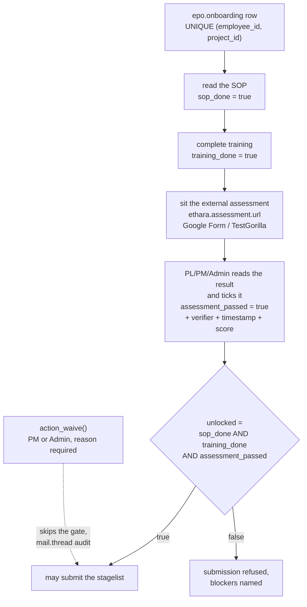

Odoo does **not** grade. It stores only the URL and the pass mark; a human reads the result
in the external application and records it. That makes the tick the one place a person
asserts something the system cannot verify, so it is stamped and audited:

| Constraint | Forbids |
|---|---|
| `_verdict_stamped` | `assessment_passed` true with no verifier |
| `_score_bounds` | a score outside 0–100 |
| `_sop_stamped` / `_training_stamped` | a done flag with no timestamp |
| `_waiver_audited` | a waiver with no reason or no waiver |
| `_uniq` | two onboarding rows for one (employee, project) |

### Pushing SOP + training to the assessment app

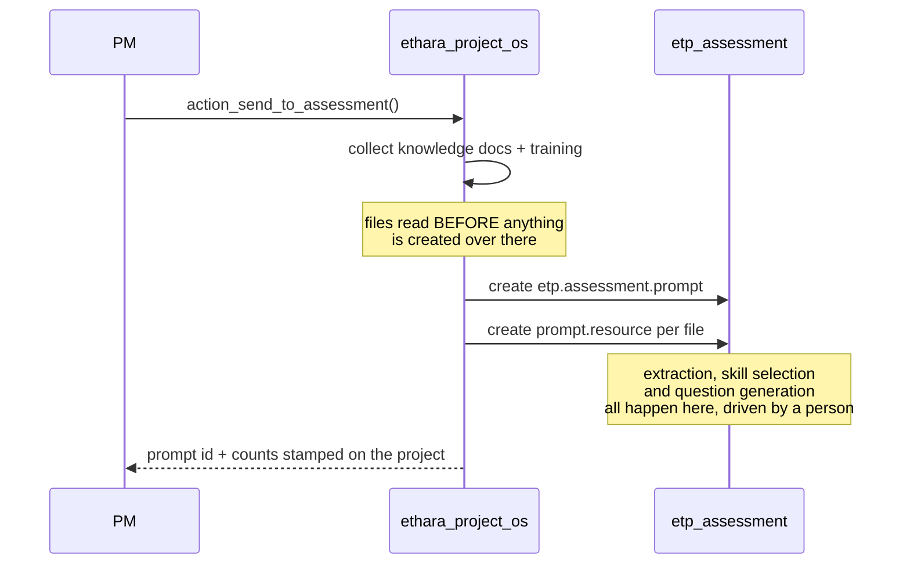

Project OS **calls** the assessment app and never modifies it. Link documents cannot be
attached (the far side needs a file), so their URLs go across as notes and the summary says
how many went each way rather than pretending everything was sent.

---

## Part 5 — Staffing

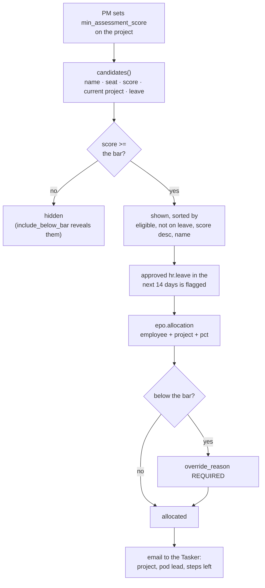

Allocation invariants, all enforced in the database:

| Constraint | Forbids |
|---|---|
| `epo_allocation_no_self_overlap` | the same person on the same project twice over overlapping dates (Postgres `EXCLUDE`, needs `btree_gist`) |
| `epo_allocation_pct_bounds` | a percentage of 0 or less, or above 100 |
| `epo_allocation_range_sane` | `date_to` before `date_from` |
| `epo_allocation_release_audited` | closing an allocation without recording who released the person |

Plus a Python check: combined open allocations may not exceed the configured ceiling
(`epo.allocation.max_pct`, default 100, clamped to 1–1000 so a misconfiguration cannot lock
the whole organisation out of being staffed). Allocating to a project still in `setup` is
refused.

---

## Part 6 — Daily tasking

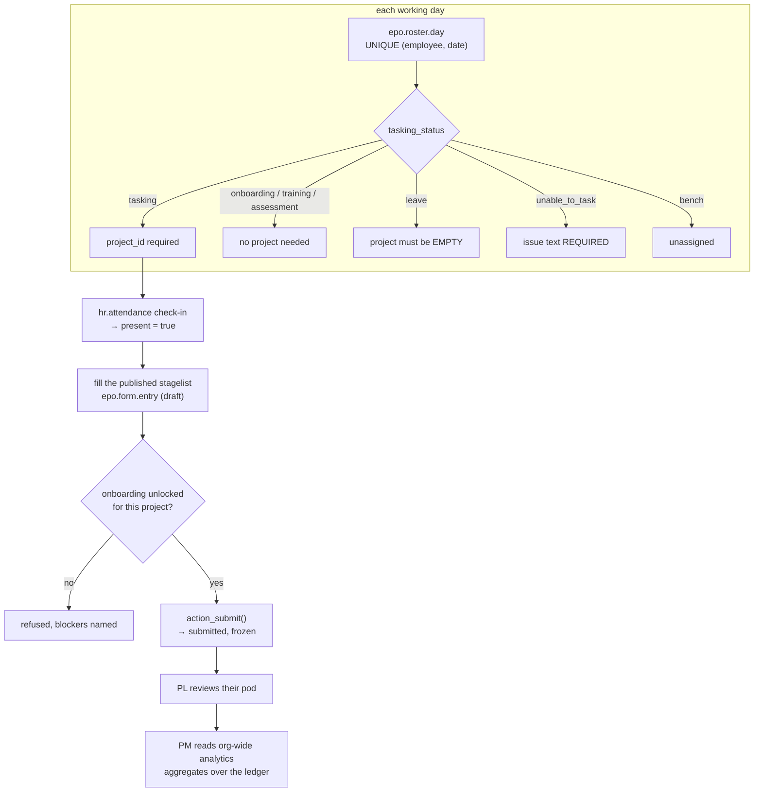

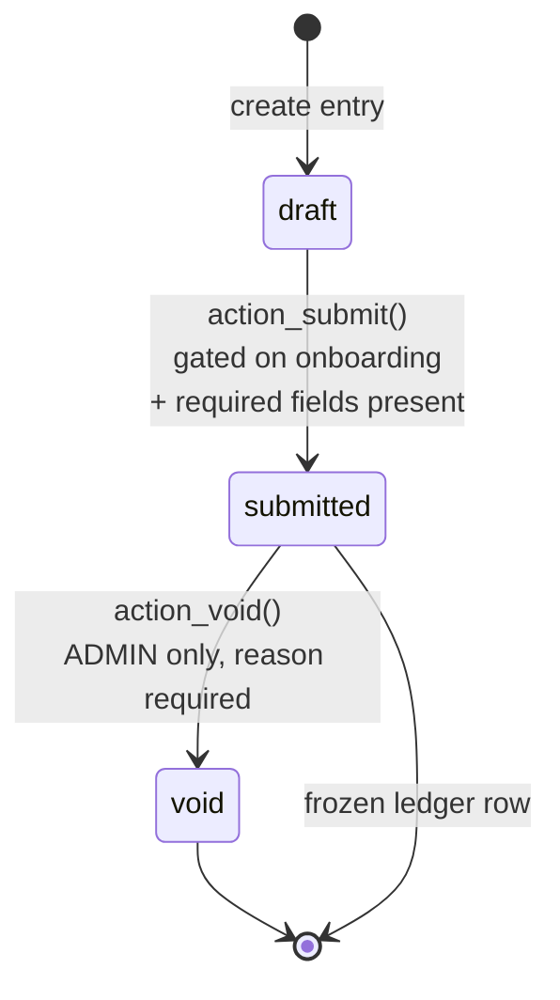

The ledger is append-only by design. A submitted entry refuses changes to its
`business_date`, `employee_id` and `state`, and refuses deletion. One entry per
`(template, employee, business_date)`. An idempotency key makes a retried POST return the
original entry rather than a duplicate — the difference between a flaky network and a
corrupted count.

A roster day inside a payroll-locked period can only be changed by an Admin
(`action_unlock`).

---

## Part 7 — Leave, running in parallel

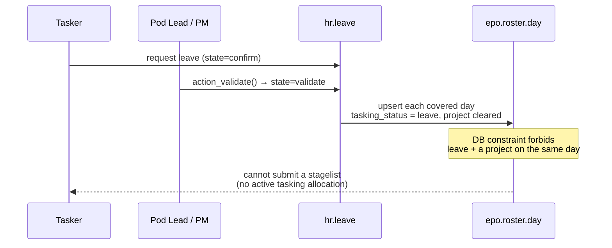

Leave and tasking are mutually exclusive at the database level
(`epo_roster_day_leave_unprojected`), so the two subsystems cannot disagree.

---

## Part 8 — Winding down

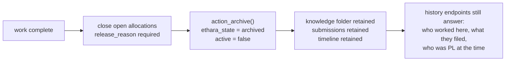

Nothing is deleted. `epo.role.assignment` is effective-dated, so *"who was Pod Lead when
this was reviewed?"* has an answer that mutable group membership could never give.

---

## The whole thing, one diagram

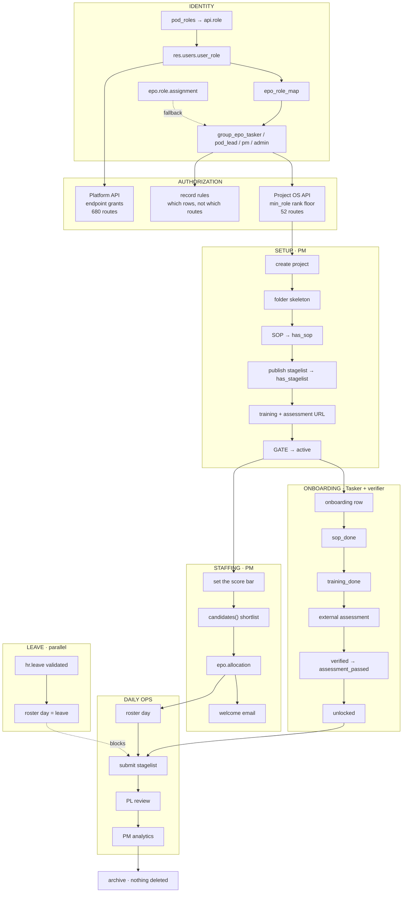

---

## Data model

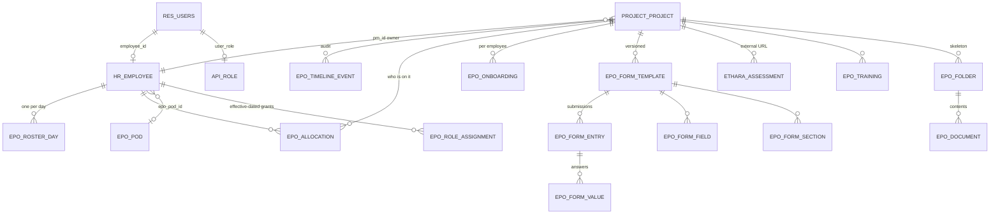

Key uniqueness rules:

| Model | Unique on |
|---|---|
| `project.project` | `lower(code)` where `code` is set |
| `epo.pod` | `lower(code)` among active pods |
| `epo.onboarding` | `(employee_id, project_id)` |
| `epo.roster.day` | `(employee_id, date)` |
| `epo.form.template` | `(project_id, form_type)` where published; `(project, form_type, version)` |
| `epo.form.entry` | `(employee_id, template_id)` **where state = draft** — one open draft at a time; `(employee_id, idempotency_key)` where a key was supplied |
| `epo.form.value` | `(entry_id, field_id)` |
| `epo.folder` | `lower(name)` within a parent; `slug` per project for system folders |

> **There is no per-day uniqueness on `epo.form.entry`.** Nothing stops a second
> *submitted* entry for the same `(template, employee, business_date)` — verified by
> replaying one entry's own answers as a new submission. The only protection is the
> idempotency key, and only when the client sends one. See *Known gaps*.

---

## Configuration

| `ir.config_parameter` key | Default | Effect |
|---|---|---|
| `epo.allocation.max_pct` | 100 | combined allocation ceiling, clamped 1–1000 |
| `epo.roster.carry_forward` | on | copy yesterday's roster forward |
| `etp_assessment.vertex_project_id` / `_location` / `_model` | — | required by the assessment app for question generation |
| `s3.connector` settings | — | bucket for documents; without it everything must be a link |

---

## Known gaps

Open findings from the strict review, listed so nobody mistakes this document for a clean
bill of health.

| Severity | Where | Issue |
|---|---|---|
| Critical | `pod_roles` + `api_auth_gateway` | every role is granted all 680 endpoints; the grant's `method` field is never enforced (`_endpoint_allowed` reads it only in a log line), so a Tasker's "GET" grant permits any verb |
| Critical | `project_project.action_send_to_assessment` | no `has_group` check in the body — the view's `groups=` is UI-only, so a read-only member can push project documents into another module. The other five gated buttons all check in code |
| High | `epo_form_entry._check_entry_open` | `@api.constrains('entry_id')` never fires on a `value_text` write, and `unlink()` runs no constraints — so answers on a *frozen* submission can be rewritten or deleted with `state` and `submitted_at` untouched |
| High | `epo_form_template.write` | guards only `form_type` and `project_id`, so `state` is writable; and `_recompute_gate()` is called only from `action_publish`. Un-publish then delete leaves a project `active` with `has_stagelist = true` and no stagelist at all |
| High | `epo.form.entry` | no uniqueness on `(template, employee, business_date)` — a second *submitted* entry for the same day is accepted, so any count aggregated over the ledger can be inflated by replaying a submission. `_one_draft` only stops two open drafts; the idempotency key only helps when the client supplies one |
| Medium | `action_send_to_assessment` | a second send orphans the first prompt; archived projects send; an SOP is not actually required |
| Medium | duplicate `api.role` records | `pod_roles` and `api_auth_gateway` both ship `Admin`/`PL`/`Tasker` with identical `name`, but 680 vs 0 endpoint grants — the picker shows two indistinguishable entries with opposite consequences |
| Low | `epo.roster.carry_forward` | `'no'`, `'off'`, `''`, `'garbage'` all read as **on**; only `'False'/'false'/'0'/'None'` disable it |
| Low | `ethara.assessment.url` | bare `http://` with no host passes validation |
| Low | `scope_pod_id` | displayed but never used for scoping |

### Breaking change in 19.0.1.5.0

The role rename reaches the API. These now emit the new vocabulary:

```
controllers/projects.py:117   'role': ctx.role          ← /me
controllers/work.py:326       'role': employee.epo_role
controllers/history.py:137    'role': r.role
```

A Programme Manager is now `"role": "pm"`. A stale client already knows `"pm"` — as *pod
member* — so it will not crash; it will treat the most privileged non-admin role as the
least privileged one. **Client releases must be coordinated with this upgrade.**

---

*Verified against `ethara_project_os` 19.0.1.5.0: 96/96 tests passing, full migration chain
1.0.1 → 1.5.0 applied on a populated database with group membership, project owners and
stored role values preserved.*
