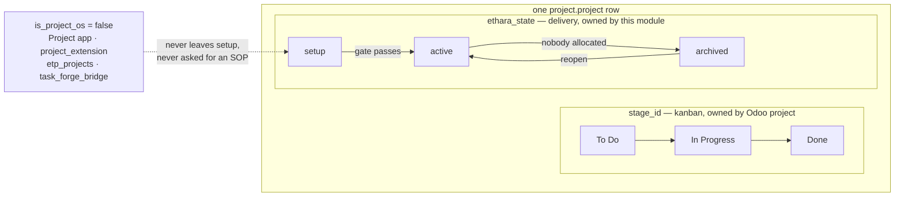
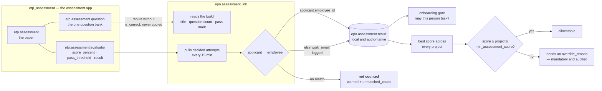

# Ethara Project OS — Workflow

How work actually moves through the system, from a PM having an idea for a project to a
Tasker submitting their thousandth stagelist row.

Read this alongside [README.md](README.md), which covers *what* each part is. This
document covers *when* each part happens and *who* does it.

To watch it rather than read it, install with `--with-demo` and log in as
`gita@demo.ethara` / `demo1234`: the demo data is a worked example of everything below,
built by running these very steps.

---

## The whole thing, on one page

```mermaid
flowchart TD
    START([PM has work to run]) --> CREATE

    subgraph P1["PHASE 1 · KICKOFF — PM"]
        direction TB
        CREATE["<b>1. Create project</b><br/>a row in project.project<br/>is_project_os = true"]
        CREATE --> CODE["code generated<br/>EPR/2026/0007"]
        CREATE --> CAB["folder cabinet built<br/>Knowledge · Management"]
        CREATE --> SETUP["ethara_state = setup<br/>not allocatable, not fillable"]
        CAB --> KN["<b>2. Fill Knowledge</b><br/>SOP · Common Errors · Task Videos<br/>files to S3, links stored as URLs"]
        SETUP --> TR["<b>3. Set training</b><br/>mandatory sessions gate onboarding"]
        TR --> ASMT["<b>4. Link assessment</b><br/>points at etp.assessment<br/>no questions authored here"]
        ASMT --> FORMS["<b>5-6. Build stagelist<br/>and feedback form</b>"]
        FORMS --> PUB["<b>7. Publish stagelist</b>"]
    end

    KN --> SOPF[/"has_sop"/]
    PUB --> SLF[/"has_stagelist"/]
    SOPF --> GATE
    SLF --> GATE

    GATE{"<b>GO-LIVE GATE</b><br/>a database CHECK,<br/>not an API check"}
    GATE -->|"both true"| LIVE["<b>ethara_state = active</b><br/>the project can take people"]
    GATE -->|"either missing"| BLOCKED["stays in setup<br/>gate_blockers names what is missing"]
    BLOCKED -.->|"PM fills the gap"| KN

    LIVE --> CAND

    subgraph P2["PHASE 2 · STAFFING — PM then PL"]
        direction TB
        CAND["<b>8. Check the candidates</b><br/>filtered by the project's<br/>min_assessment_score"]
        CAND --> ALLOC["<b>Allocate</b><br/>bar and score snapshotted<br/>onto the allocation"]
        ALLOC --> ONB0["onboarding record opens<br/>first phase starts"]
        ALLOC --> MAIL["email to the Tasker<br/>project, pod lead, steps left"]
        ONB0 --> ROSTER["<b>9. Daily roster</b> — PL<br/>tasking · onboarding · training<br/>assessment · leave · bench"]
        ROSTER --> PHASE["phase log accumulates<br/>nobody types a duration"]
    end

    ROSTER --> ONB

    subgraph PLV["RUNS IN PARALLEL · LEAVE — anyone"]
        direction TB
        LV["hr.leave submitted<br/>native Odoo workflow"]
        LV --> LVA["approved by the pod lead"]
        LVA --> LVR["stamped onto every day<br/>the leave actually covers"]
        LVR --> LVP["open phase closes<br/>time off never inflates<br/>time on the project"]
    end
    LVR -.->|"no tasking allocation<br/>that day"| ROSTER

    subgraph P3["PHASE 3 · ONBOARDING — Tasker"]
        direction TB
        ONB["<b>10. SOP → Training → Assessment</b>"]
        ONB --> SOPD["SOP read"]
        ONB --> TRD["training attended"]
        ONB --> ASD["assessment passed<br/>read from epo.assessment.result"]
        SOPD --> UNLOCK
        TRD --> UNLOCK
        ASD --> UNLOCK
        UNLOCK{"every mandatory<br/>stage clear?"}
        UNLOCK -->|"a stage with no<br/>content auto-passes"| OPEN["<b>CLEARED TO TASK</b><br/>allocation moves to tasking<br/>today's roster follows"]
    end

    OPEN --> TASK

    subgraph P4["PHASE 4 · TASKING — Tasker"]
        direction TB
        TASK["<b>11. Fill the stagelist</b>"]
        TASK --> FB["<b>12. Log client feedback</b>"]
        FB --> LEDGER[("submission ledger<br/><b>append-only</b>")]
    end

    LEDGER --> REVIEW

    subgraph P5["PHASE 5 · REVIEW"]
        direction TB
        REVIEW["<b>13. PL reviews the pod</b>"]
        REVIEW --> ANALYTICS["<b>14. Analytics</b> — PM<br/>every number an aggregate<br/>over the ledger and the phase log"]
        ANALYTICS --> HIST["<b>History</b><br/>by person, or by project<br/>the same rows, two lenses"]
    end

    HIST --> RELEASE

    subgraph P6["PHASE 6 · WINDING DOWN — PM"]
        direction TB
        RELEASE["<b>15. Release people</b><br/>phases close, numbers trimmed<br/>nothing deleted"]
        RELEASE --> ARCH{"anyone still<br/>allocated?"}
        ARCH -->|"yes"| REFUSE["<b>refused</b><br/>release them first"]
        ARCH -->|"no"| ARCHIVED["<b>16. Archived</b><br/>submissions readable<br/>history whole, reopenable"]
        REFUSE -.-> RELEASE
    end
```



Each numbered step below gives the actor, the API call, what changes in the database,
and what the system refuses.

Three things worth holding on to before the detail:

* **The roster is the engine.** A pod lead setting somebody's status each morning is
  what produces the phase log, and the phase log is what answers "how long did
  onboarding take on this project". Nobody types a duration in anywhere.
* **Nothing is a counter.** Every number on every screen is an aggregate over the
  submission ledger and the phase log, so two screens cannot disagree.
* **Nothing here authors content it does not own.** The project is a row in Odoo's own
  `project.project`; the questions live in the assessment app. This module links and
  reads, and marks its own rows with `is_project_os` so it can never touch anybody
  else's.

### The two lifecycles on one record

`project.project` is shared: Odoo's Project app, `project_extension`, `etp_projects` and
`task_forge_bridge` all own rows on it. The kanban stage and the Ethara delivery state
are separate fields on the same row, and neither drives the other:



A project any of the other four owners creates sits at `ethara_state = setup` with
`is_project_os` false forever. It satisfies the go-live CHECK trivially and no gate,
folder skeleton or record rule in this module ever touches it.

### Where an assessment score comes from

Project OS owns no question bank. The paper, the questions and the grading all live in
the assessment app; what crosses the boundary is a verdict:



`pending` never crosses: scoring is still running, and the gate must not decide on a
number that is still moving. The two thresholds are different questions — the paper's
`pass_threshold` asks *did this attempt pass*, the project's `min_assessment_score` asks
*is that good enough for this project*.

---

## Phase 1 — Kickoff (PM)

### 1. Create the project

```http
POST /api/project-os/projects
{ "name": "Multimango Batch 7", "project_type": "external" }
```

The project is a row in **`project.project`** — Odoo's native project (data model v2
§4.2). Project OS keeps no project table of its own; what this module adds is the
delivery side of the native record.

Four things happen atomically:

| | |
|---|---|
| **is_project_os** | `true` — this row is now in the delivery pipeline |
| **code** | generated — `EPR/2026/0007` (§4.2, one series for all Ethara projects) |
| **ethara_state** | `setup` — not allocatable, not fillable |
| **folders** | the full skeleton, immediately |

Two lifecycles run on the record and they are not the same field:

| field | owner | values | what it means |
|---|---|---|---|
| `stage_id` | Odoo `project` | configurable kanban columns | the board position — untouched here |
| `ethara_state` | this module | setup · active · archived | the **delivery** lifecycle — the go-live gate |

`project.project` has no `state` field at all, which is why v2 §4.2 namespaces the
Ethara lifecycle. The API still calls it `state`, because that is what it has always
meant to a client of `/api/project-os/*`.

**Two deviations from the doc, both forced by this database rather than by the design.**
`project_type` is already taken on this table by `project_extension`
(`single_turn` / `multi_turn`), so the Ethara one is **`ethara_project_type`** — the same
namespacing v2 applies to `ethara_state`, for the reason v2 gives. And **`is_project_os`**
marks the rows this pipeline owns, because Odoo's Project app plus `project_extension`,
`etp_projects` and `task_forge_bridge` all own rows here; v2 §6.3 and §10.4 both call for
exactly this gate.

```
EPR/2026/0007/
├── Knowledge/        SOP · Common Errors · Task Videos · Other
└── Management/       Client Documents/
```

A `project_created` event lands on the timeline.

**Refused:** a duplicate name, a duplicate code (case-insensitively), a blank name.
Name uniqueness is scoped to Ethara projects (a partial index on `is_project_os`), so
it never collides with a project the Project app or another module owns.

### 2. Fill the Knowledge folder

```http
POST /api/project-os/folders/<sop_folder_id>/documents
   multipart: file=@induction.pdf
   or JSON:   { "name": "SOP v3", "url": "https://docs…" }
```

Files always go to S3 — the Knowledge and Management folders *are* the bucket layout.
With no bucket configured the upload is refused rather than quietly stored elsewhere.
Either way they are fetched through `GET /documents/<id>/download`, which mints a link
that expires.

The moment the first document lands in **SOP**, `has_sop` flips true. That is half the
go-live gate.

**Refused:** a `javascript:` or `data:` link, a file document with no file, a second
document with the same name in the same folder, and any upload at all when no bucket is
configured.

### 3. Set training

```http
POST /api/project-os/projects/<id>/training
{ "name": "Kickoff walkthrough", "mode": "recorded", "url": "https://…" }
```

Mark it `is_mandatory` to make it gate onboarding. A project with no mandatory training
auto-passes that step — the gate never blocks on a stage nobody set up.

### 4. Link the assessment

The paper is authored **in the assessment app** — Project OS owns no question bank, and
`etp.assessment.question` is the one bank in this deployment. This only points at it:

```http
POST /api/project-os/projects/<id>/assessment
{ "etp_assessment_id": 91, "max_attempts": 2 }
```

Title, question count and pass mark are read off the paper, so the link can never
disagree with the thing it links to. A federated paper in another system still works —
send `{"source_kind": "remote", "external_id": "ASMT-91", "pass_score": 70}` — and is
snapshotted with the answer key stripped.

From then on the gate reads a **local** `epo.assessment.result` row, so an assessment
app outage never blocks somebody already graded.

**Results come back on their own.** Every 15 minutes, decided attempts
(`etp.assessment.evaluator.result` = pass/fail) are pulled across:

```
etp.assessment.evaluator          epo.assessment.result
  score_percent            ─────▶   score
  result  pass/fail        ─────▶   passed
  pass_threshold           ─────▶   pass_score_applied  (snapshotted per attempt)
```

`pending` is never imported: scoring is still running, and the gate must not decide on a
number that is still moving.

**The candidate ↔ Tasker match.** The assessment app scores `hr.applicant`; Project
OS staffs `hr.employee`. The link uses `hr.applicant.employee_id` when it is set, and
falls back to matching the applicant's email against `work_email` — every fallback is
logged, because a score that gates staffing has to be traceable to the person it belongs
to. A graded candidate matching nobody is **not counted**, is logged as a warning, and
shows on the link as `unmatched_count`.

### 5–6. Build the stagelist and the feedback form

```http
POST /api/project-os/templates            { "project_id": 7, "form_type": "stagelist" }
PUT  /api/project-os/templates/<id>       { "sections": [ { "title": …, "fields": [ … ] } ] }
```

Twelve field types, sections, required flags, dropdown options, rating grids.

**Refused:** a dropdown with no options, a required section header, `PUT` on a template
that is already published (409 — create a new version instead).

### 7. Publish → the project goes live

```http
POST /api/project-os/templates/<id>/publish
```

Publishing the stagelist sets `has_stagelist`. If the SOP is already there, **the project
activates automatically** — no separate button to forget.

```
ethara_state: setup ──────▶ active
           ▲
           └── refused unless has_sop AND has_stagelist
               (a database CHECK, not an API check)
```

The CHECK is `ethara_state <> 'active' OR (has_sop AND has_stagelist)`. Because it is
on `ethara_state`, every project the Project app or the other three modules own
satisfies it trivially — it sits at `setup` and is never asked for an SOP.

**Refused:** activating without an SOP or a published stagelist; publishing a form with
no answerable fields.

---

## Phase 2 — Staffing (PM → PL)

### 8. Allocate people

**Two thresholds, and they are not the same number.**

```
etp.assessment                 epo.assessment.link       ethara.project
  pass_threshold  ──────────▶    pass_score               min_assessment_score
  "did this attempt pass?"       (snapshotted per          "is that score good
                                  attempt as               enough for THIS
                                  pass_score_applied)      project?"
```

A paper may pass at 60 while a project only takes people who scored 80 somewhere. The
project's bar is checked against `hr.employee._epo_best_assessment_score()` — the
person's **best graded score across every project**, which is exactly what the results
pull keeps up to date. Set `min_assessment_score` to 0 for no bar.

First, who is even eligible? The PM sets a minimum score on the project; the candidate
list answers "so who does that leave me?":

```http
GET /api/project-os/projects/7/candidates

  ✓ Mira    88   eligible
    Noor    40   scored 40, needs 80
    Ravi     —   no assessment score yet
```

Then staff them:

```http
POST /api/project-os/allocations/bulk
{ "project_id": 7, "employee_ids": [12, 15, 22], "allocation_pct": 100 }
```

Per person this creates:

* an **allocation** — the membership record (from date, %, role on project), with the
  project's bar and the person's score snapshotted onto it;
* an **onboarding** record — the gate, starting closed;
* the first **phase** — `onboarding`, open-ended;
* an **email to the Tasker** naming the project, their pod lead, and the steps left.

**Refused:** allocating to a project still in `setup`; the same person twice over
overlapping dates; a combined allocation over 100% across concurrent projects; **anybody
below the project's minimum score**, unless an `override_reason` is given — which is
mandatory in that case and audited. Already-allocated people are *skipped*, not errors —
one stale checkbox must not abort a batch of twelve.

### 9. The daily roster (PL)

Every morning the Pod Lead sets what each person is actually doing:

```http
GET   /api/project-os/roster?date=2026-07-24
PATCH /api/project-os/roster/<employee_id>
{ "tasking_status": "training", "project_id": 7, "present": true }
```

Statuses: `tasking` · `onboarding` · `training` · `assessment` · `leave` ·
`unable_to_task` · `bench`.

**This is the engine behind every duration figure.** Setting a status closes the current
phase and opens the new one, so the phase log accumulates from work the lead was doing
anyway:

```
allocation ─┬─ onboarding  Jul 14 → Jul 18   5 days
            ├─ training    Jul 19 → Jul 21   3 days
            └─ tasking     Jul 22 → open     3 days
```

`leave`, `bench` and `unable_to_task` **close** the open phase without opening a new
one — time off the project must never inflate time on it.

**Refused:** two rows for one person on one day; `unable_to_task` with no reason; `leave`
with a project attached; a date beyond tomorrow (planning is the allocation's job);
rostering somebody onto a project they are not allocated to; editing a payroll-locked
day (Admin unlocks, with a reason, and it is audited).

**Automatic:** a nightly job carries yesterday's roster into today, approved leave is
stamped onto the days it covers, and an attendance check-in sets `present`.

---

## Phase 3 — Onboarding (Tasker)

### 10. SOP → Training → Assessment

```http
GET  /api/project-os/me/onboarding      → what is left to do
POST /api/project-os/me/onboarding/sop
POST /api/project-os/me/onboarding/training
GET  /api/project-os/me/assessment      → the questions, never the key
POST /api/project-os/me/assessment      → { "answers": { "12": 2, "13": 0 } }
```

```
   SOP ──▶ Training ──▶ Assessment ──▶ CLEARED TO TASK
    │         │              │
    └─────────┴──────────────┴── a stage with no content auto-passes
```

The moment the last stage clears:

* `unlocked` flips, stamped with the time;
* the allocation moves from `onboarding` to `tasking`;
* today's roster row follows;
* an `onboarding_unlocked` event lands on the timeline.

Grading happens in the source system. If it is unreachable the attempt is stored as
`submitted` and a job grades it within the half hour — nobody loses their work to
someone else's downtime.

**Escape hatch:** `POST /onboarding/<id>/waive` — PM only, reason mandatory, written to
the audit log. It is the one place somebody starts work with no evidence they are ready,
so it leaves the loudest trail in the system.

---

## Phase 4 — Tasking (Tasker)

### 11–12. Fill the stagelist and the feedback form

```http
GET  /api/project-os/me/form?form_type=stagelist
POST /api/project-os/entries
{ "template_id": 9,
  "answers": [ { "field_id": 31, "text": "T-1001" } ],
  "idempotency_key": "b3f1…" }
```

`GET /me/form` answers with a *reason* rather than an error when there is nothing to
fill — `no_project`, `no_form`, `onboarding_incomplete` are ordinary screens, not
failures.

Every submission is checked against five things before it is stored:

```
template published?  ─┐
project active?       ├─▶ all five, or the submission is refused
allocated that day?   │
onboarding cleared?   │   (stagelist only)
required fields?     ─┘   (at submit, not at draft)
```

Send the same `idempotency_key` twice and you get the *original* entry back — a retried
POST on a flaky connection must not inflate every count.

**Then it is evidence.** A submitted entry cannot be edited or deleted. A correction is
an Admin void (with a reason) plus a fresh submission, so a number that was true
yesterday stays true.

---

## Phase 5 — Review and reporting

### 13. The Pod Lead reviews (PL)

```http
GET /api/project-os/counts?form_type=stagelist
GET /api/project-os/submissions?project_id=7&date_from=2026-07-01
GET /api/project-os/submissions/<id>          → the answers, with the form that was filled
GET /api/project-os/onboarding?pending_only=1 → who is still ramping up
```

Everything is scoped automatically: a PL sees their pod, a PM sees the org, a Tasker sees
themselves. Not by a filter the client sends — by record rules that hold even if the
request arrives some other way.

### 14. Analytics (PM)

```http
GET /api/project-os/analytics/overview?date_from=2026-07-01
```

Projects by state, projects blocked from go-live and what they are missing, people
allocated vs. ramping vs. tasking, submissions by project. All of it computed from the
ledger and the phase log — **there is not one counter column in the module**, so no two
screens can disagree.

### History — the two readings

```http
GET /api/project-os/employees/<id>/history   → a person's whole life across projects
GET /api/project-os/projects/<id>/history    → a project's whole life across people
```

Same rows, two lenses:

| a person's history | a project's history |
|---|---|
| every project joined and left | everyone who joined and left |
| days in onboarding / training / assessment / tasking, per project | who is at which phase right now |
| days to first productive day | average days to productive |
| every role grant, every assessment attempt | when it went live, every form version |
| every submission count | total submissions |

---

## Phase 6 — Winding down (PM)

### 15. Release people

```http
POST /api/project-os/allocations/<id>/release          → today
POST /api/project-os/allocations/<id>/release  { "date_to": "2026-07-19" }  → back-dated
```

The membership closes, every open phase closes with it, and the numbers are trimmed to
the window — a back-dated release does not leave phase days that outlive the allocation.
Nothing is deleted: submissions, phases and history all survive.

### 16. Archive the project

```http
POST /api/project-os/projects/<id>/archive
```

**Refused while anyone is still allocated** — archiving with open allocations would leave
people tasking on a dead project. Release them first.

Archived is not gone: submissions stay readable, the history stays whole, and the project
can be reopened, which is recorded as `project_reopened`.

---

## Who can do what

| Action | Tasker | PL | PM | Admin |
|---|:--:|:--:|:--:|:--:|
| fill the stagelist / feedback form | ✓ | ✓ | ✓ | ✓ |
| complete their own onboarding | ✓ | ✓ | ✓ | ✓ |
| read Knowledge of a project they are on | ✓ | ✓ | ✓ | ✓ |
| edit the daily roster | — | pod | ✓ | ✓ |
| review submissions | own | pod | all | all |
| create / publish projects and forms | — | — | ✓ | ✓ |
| allocate and release people | — | — | ✓ | ✓ |
| read **Management** (client documents) | — | — | ✓ | ✓ |
| waive onboarding | — | — | ✓ | ✓ |
| void a submission | — | — | — | ✓ |
| unlock a payroll-closed day | — | — | — | ✓ |
| read the audit log | — | — | — | ✓ |

Roles come from `epo.role.assignment`, which is effective-dated and drives Odoo group
membership. Revoking is a date, not a deletion — so "who was Pod Lead when this was
reviewed?" always has an answer.

---

## What runs on its own

| Job | When | Why it exists |
|---|---|---|
| carry the roster forward | 00:20 daily | otherwise the board is empty every morning and the system looks broken |
| stamp approved leave onto the roster | 00:40 daily | leave approved weeks ago still has to land on the right day |
| grade pending assessments | every 30 min | picks up attempts the source system could not grade in the moment |
| pull assessment results | every 15 min | a decided attempt opens the onboarding gate; waiting 6 h for it is a Tasker sitting on their hands |
| refresh assessment snapshots | every 6 h | keeps title, question count and pass mark in step with the paper |
| lock roster days past payroll | 02:00 daily | stops accidental retro-edits after payroll closes |

---

## Refusals worth knowing before you build a UI

These hold in the database or the model, so no client-side check will save you from
them — design the screens to prevent them reaching the API instead:

1. **A project cannot go live without an SOP and a published stagelist.** Show the
   blockers (`gate_blockers`) on the project card, not just on the activate button.
2. **A published form cannot be edited.** Offer "new version", not "edit" — `PUT` on a
   published template returns 409. The new version arrives carrying the whole form, so
   the builder screen opens populated.
3. **A submitted entry cannot be changed.** Offer void-and-resubmit to Admins only.
4. **Nobody can submit before onboarding clears.** `GET /me/form` returns
   `reason: "onboarding_incomplete"` with the blockers — route to the onboarding screen
   rather than showing a form that will be rejected.
5. **Nobody can be rostered onto a project they are not allocated to.** Populate the
   project dropdown from `allowed_projects` on `GET /me` — every live project whose
   allocation covers today, which is exactly the set the roster and the submission
   guard will accept. Not from `GET /projects`, and not from the single
   `epo_current_project_id`: part-time membership across two projects is legitimate,
   so "what may I work on today" is a list.
6. **Nobody below the project's minimum score can be allocated.** Drive the picker from
   `GET /projects/<id>/candidates`, which returns everybody with an `eligible` flag and
   a reason — show the ineligible greyed out rather than hiding them, and offer the
   `override_reason` field as a deliberate second step.
7. **A file cannot be uploaded with no bucket configured.** If `POST …/documents`
   returns "No document bucket is configured", that is a setup problem, not a user
   error — say so and offer the link option instead.

### And two things that are *not* errors

* `GET /me/form` answering `has_form: false` with `reason: "no_project"` or `"no_form"`
  is an ordinary screen, not a failure. So is an empty roster before the nightly job has
  run.
* A bulk allocation returning fewer allocations than names sent, with a `skipped` list.
  Show the list; the batch did not fail.
