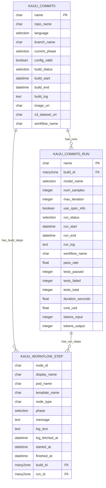
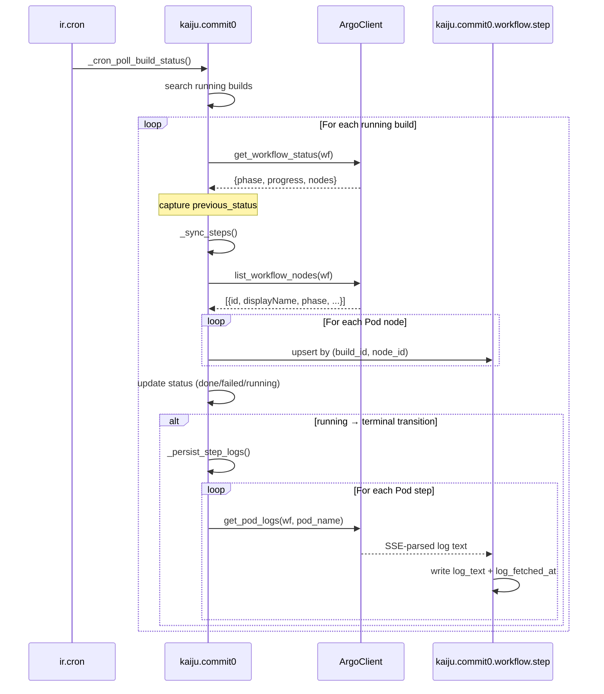
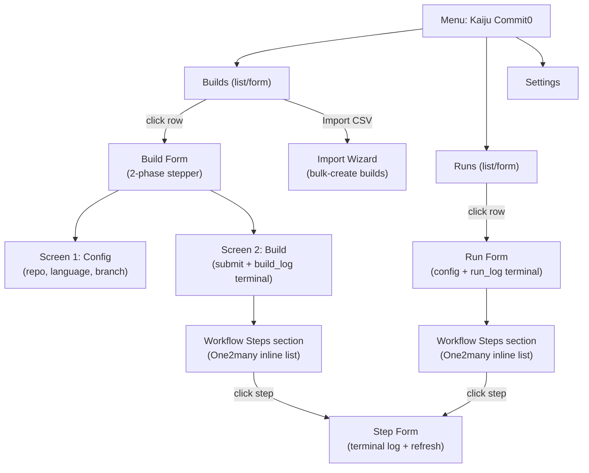
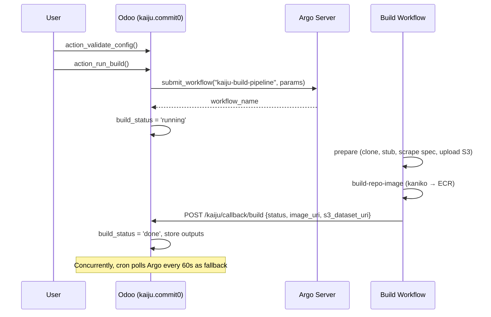
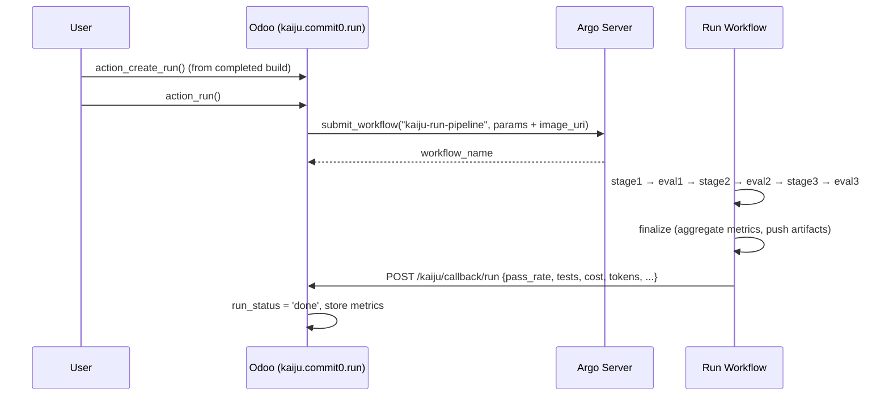
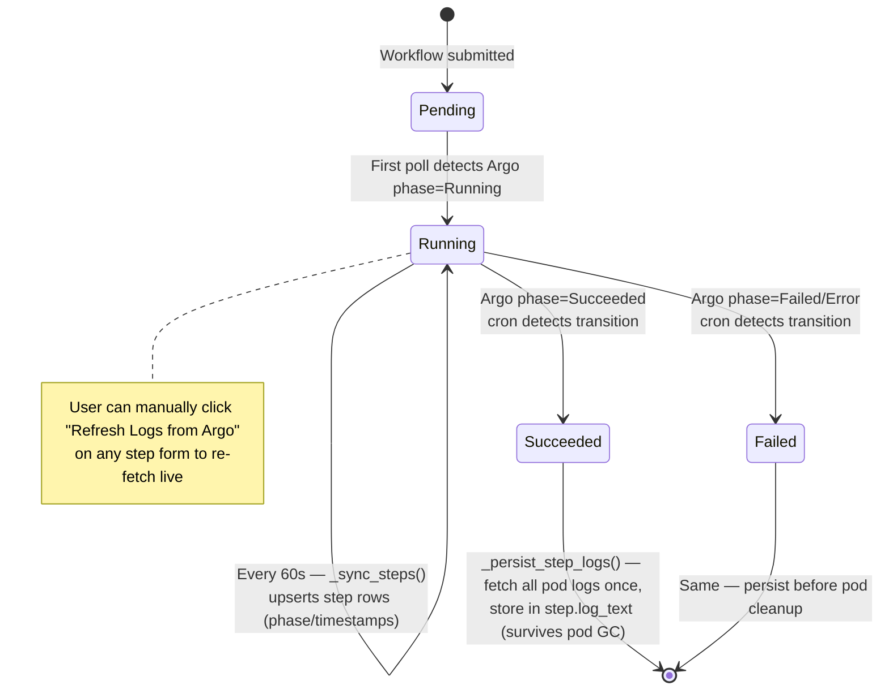

# kaiju_commit0 — Odoo Module Architecture

Current state as of 2026-05-14 (post workflow-logs feature).

---

## 1. Purpose

Odoo-facing control plane for the **Kaiju AI Coding Benchmark** pipeline.
Users create **Builds** (one per target repository) and **Runs** (one per LLM
model evaluation against a built image). The module submits Argo Workflows
to an EKS cluster, polls/receives status updates, and surfaces per-step pod
logs inside the Odoo UI — even after Argo's pod garbage collection.

---

## 2. Module Layout

```
kaiju_commit0/
├── __manifest__.py                     # Module manifest (deps: base, web)
├── __init__.py
├── controllers/
│   └── main.py                         # Webhook receiver (build + run callbacks)
├── data/
│   ├── ir_config_parameter_data.xml    # Argo URL, namespace, tokens
│   ├── ir_cron_data.xml                # 2 cron jobs (build poll, run poll)
│   └── ir_sequence_data.xml            # Build/Run ID sequences
├── models/
│   ├── argo_client.py                  # AbstractModel — HTTP client for Argo
│   ├── kaiju_commit0.py                # Build record + cron + step sync/persist
│   ├── kaiju_commit0_run.py            # Run record + cron + step sync/persist
│   ├── kaiju_workflow_step.py          # Per-step pod log + status (NEW)
│   └── res_config_settings.py          # Settings UI binding
├── security/
│   ├── ir.model.access.csv             # ACLs (build, run, step, wizard)
│   └── kaiju_commit0_security.xml      # Security groups
├── static/src/components/
│   ├── phase_stepper/                  # OWL widget — phase navigation
│   └── terminal_viewer/                # OWL widget — terminal-style log
├── views/
│   ├── kaiju_commit0_views.xml         # Build list + form
│   ├── kaiju_commit0_run_views.xml     # Run list + form
│   ├── kaiju_workflow_step_views.xml   # Step list + form (NEW)
│   ├── kaiju_commit0_menus.xml         # Menu structure
│   └── res_config_settings_views.xml   # Settings form (Argo config)
└── wizard/
    └── import_csv_wizard.py            # Bulk-import builds from CSV
```

---

## 3. Domain Model (ERD)



**Constraints**:

- `kaiju.commit0.workflow.step` has a SQL CHECK enforcing exactly one of `build_id`/`run_id` is set
- Composite uniques: `(build_id, node_id)` and `(run_id, node_id)` — a node id is unique within a workflow

---

## 4. Configuration (`ir.config_parameter`)

| Key | Default | Used By |
|---|---|---|
| `kaiju.argo_server_url` | `https://argo-workflows-server.argo.svc.cluster.local:2746` | `ArgoClient._get_config()` |
| `kaiju.argo_namespace` | `argo` | `ArgoClient` (all endpoints) |
| `kaiju.argo_token_path` | `/var/run/secrets/kubernetes.io/serviceaccount/token` | `ArgoClient._get_token()` (in-cluster SA token) |
| `kaiju.argo_verify_tls` | `false` | `ArgoClient` (SSL context) |
| `kaiju.odoo_internal_url` | `http://odoo-web.odoo.svc:8069` | Build/Run callback URL builder |
| `kaiju.webhook_token` | `CHANGE-ME-...` | `KaijuCallbackController._validate_token()` |

All parameters editable via **Settings → Kaiju** (`res_config_settings.py` exposes them as transient fields).

---

## 5. Argo HTTP Client (`kaiju.argo.client`)

`AbstractModel` using **`urllib.request`** (no `requests` dep). Single internal
helper `_request(method, path, body)` returns parsed JSON; **`_request_stream`**
(added with logs feature) returns raw response text for SSE endpoints.

| Method | HTTP | Purpose |
|---|---|---|
| `submit_workflow(template, params, labels)` | `POST /api/v1/workflows/{ns}/submit` | Submit `WorkflowTemplate` |
| `get_workflow_status(name)` | `GET /api/v1/workflows/{ns}/{name}` | Returns phase + progress + nodes |
| `list_workflow_nodes(name)` | `GET /api/v1/workflows/{ns}/{name}` | Filters `status.nodes` to Pod-type only |
| `get_pod_logs(name, pod, container, tail_lines)` | `GET /api/v1/workflows/{ns}/{name}/log` | SSE-parsed plain text |
| `stop_workflow(name, msg)` | `PUT /api/v1/workflows/{ns}/{name}/stop` | Graceful stop |
| `terminate_workflow(name)` | `PUT /api/v1/workflows/{ns}/{name}/terminate` | Kill all pods |

**Auth**: `Authorization: Bearer <SA-token-from-disk>`.
**TLS**: Configurable verify; defaults to disabled (in-cluster self-signed cert).
**Timeout**: 30s default, 60s for log endpoint.
**Errors**: Wraps `HTTPError`/`URLError` as `RuntimeError` (callers catch this).

---

## 6. Webhook Controller (`/kaiju/callback/*`)

Two `http.route` endpoints, both `type="http"`, `auth="none"`, `csrf=False`,
bearer-token-authenticated.

| Route | Triggered By | Payload Fields | Effect |
|---|---|---|---|
| `POST /kaiju/callback/build` | `kaiju-build-pipeline` workflow last step | `job_id, status, image_uri, s3_dataset_uri, message?` | Sets `build_status` + outputs |
| `POST /kaiju/callback/run` | `kaiju-run-pipeline` workflow last step | `job_id, status, pass_rate, tests_*, duration_seconds, cost_usd, tokens_*` | Sets `run_status` + metrics |

**Dual-update pattern**: callbacks are the **primary** completion signal; the
1-minute cron poll is the **fallback** (works even if callback can't reach
Odoo from cluster).

---

## 7. Cron Jobs (every 1 min)



Both cron jobs follow the same pattern (build vs run). The
running→terminal transition is detected by capturing `previous_status` before
the write and comparing afterward, so logs are persisted **exactly once** —
avoiding repeated Argo log API hits after completion.

---

## 8. View / UI Architecture



**Custom OWL widgets** (loaded via `assets_backend`):

- `commit0_stepper` — phase navigation header on build form
- `commit0_terminal` — terminal-style renderer for any `Text` field. Used by `build_log`, `run_log`, and step `log_text`. Features: line-by-line reveal, error/warning colorization, copy button, light/dark toggle.

---

## 9. End-to-End Flow

### Build flow (prepare → image build → callback)



### Run flow (3-stage agentic eval → finalize → callback)



### Workflow logs lifecycle



---

## 10. Security

- All models granted full CRUD to `base.group_user` via `ir.model.access.csv`.
- Webhook routes are `auth="none"` but gated by bearer token check
  (`kaiju.webhook_token` config param).
- Argo API authenticated with the in-cluster ServiceAccount token mounted at
  `/var/run/secrets/kubernetes.io/serviceaccount/token` (Odoo must run as a
  pod with appropriate `WorkflowTemplate` permissions).

---

## 11. External Dependencies

| External System | Where Used | Contract |
|---|---|---|
| **Argo Workflows Server** | `argo_client.py` | REST + SSE; submit, poll, stop, logs |
| **EKS cluster** | Hosting Odoo + Argo | Provides ServiceAccount token for in-cluster auth |
| **S3 (e.g. `production-grtlabs-tag`)** | Read indirectly via pipeline outputs | Stored as `s3_dataset_uri` field |
| **ECR** | Read indirectly via pipeline outputs | Stored as `image_uri` field |

---

## 12. Recent Additions (Workflow Logs Feature)

| File | Type | Purpose |
|---|---|---|
| `models/kaiju_workflow_step.py` | NEW | Step model with `action_fetch_logs()` |
| `views/kaiju_workflow_step_views.xml` | NEW | Step list + form (terminal widget) |
| `models/argo_client.py` | MOD | + `_request_stream`, `list_workflow_nodes`, `get_pod_logs` (SSE parser) |
| `models/kaiju_commit0.py` | MOD | + `step_ids`, `_sync_steps`, `_persist_step_logs`, `_parse_argo_dt`; cron now syncs steps + persists logs on transition |
| `models/kaiju_commit0_run.py` | MOD | Same pattern for runs |
| `views/kaiju_commit0_views.xml` | MOD | + "Workflow Steps" inline list on build form |
| `views/kaiju_commit0_run_views.xml` | MOD | + "Workflow Steps" inline list on run form |
| `security/ir.model.access.csv` | MOD | + ACL row for `kaiju.commit0.workflow.step` |
| `__manifest__.py` | MOD | + step view XML registered |
